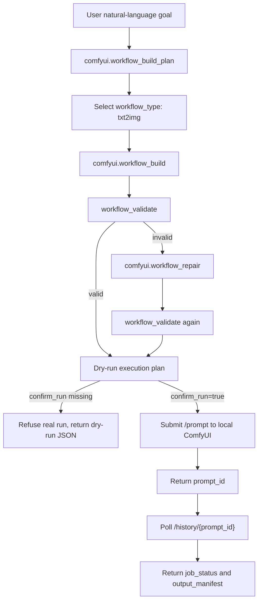

# ComfyUI Agent Workflow Protocol

This protocol describes the MVP path where an AI agent turns a natural-language goal into a ComfyUI API workflow, validates and repairs it, then submits it only after explicit confirmation.



## Tools

| Tool | Mode | Purpose | External side effect |
| --- | --- | --- | --- |
| `comfyui.workflow_build_plan` | dry-run | Converts a goal into a workflow construction plan. | None |
| `comfyui.workflow_build` | dry-run | Builds API-format workflow JSON and returns a workflow hash. | None |
| `comfyui.workflow_repair` | dry-run | Repairs missing nodes, bad numeric parameters, invalid dimensions, and core links. | None |
| `comfyui.agent_run` | dry-run by default; confirmed run with `confirm_run=true` | Runs build, validate, repair, submit, status, manifest. | Contacts local ComfyUI and may cause ComfyUI to write images to its own output folder |

## Build Plan Contract

Input:

```json
{
  "goal": "生成一张国风 Q版 明代街市人物场景图",
  "workflow_type": "txt2img",
  "style": "Q版3D半动漫国风",
  "width": 1344,
  "height": 768
}
```

Output highlights:

```json
{
  "ok": true,
  "mode": "dry_run",
  "workflow_type": "txt2img",
  "required_nodes": [
    "CheckpointLoaderSimple",
    "CLIPTextEncode_positive",
    "CLIPTextEncode_negative",
    "EmptyLatentImage",
    "KSampler",
    "VAEDecode",
    "SaveImage"
  ],
  "will_build": false,
  "will_submit": false
}
```

## Build Contract

`comfyui.workflow_build` must:

- Generate ComfyUI API-format JSON, not visual workflow JSON.
- Avoid scanning disk or reading model folders.
- Use a provided checkpoint value or a placeholder.
- Generate a `workflow_hash`.
- Return `node_summary` with class counts and output node IDs.
- Return `validation` metadata from the same validator used by `comfyui.workflow_validate`.

## Repair Contract

`comfyui.workflow_repair` must repair the txt2img core:

- Missing positive prompt.
- Missing negative prompt.
- Missing sampler node.
- Missing latent image node.
- Missing save image node.
- Bad `steps`, `cfg`, or `seed` types.
- Invalid `width` or `height`.
- Broken links between checkpoint, CLIP encoders, sampler, latent image, VAE decode, and save image.

## Run Contract

`comfyui.agent_run` must refuse real submission unless:

```json
{
  "confirm_run": true
}
```

Without confirmation, it returns:

```json
{
  "mode": "dry_run",
  "submitted": false,
  "prompt_id": null,
  "job_status": {
    "state": "not_submitted"
  }
}
```

With confirmation, it may call:

- `POST /prompt`
- `GET /history/{prompt_id}`

The returned `output_manifest` is sanitized and contains only ComfyUI output metadata such as `filename`, `subfolder`, `type`, and `node_id`. It must not include absolute local paths.

## Safety Rules

- Default path is dry-run.
- No hardcoded local model path.
- No private output path in MCP results.
- No filesystem scan for checkpoints.
- Confirmed run requires local ComfyUI to be running.
- Current MVP supports `txt2img`; ControlNet, LoRA, img2img, inpaint, and upscale remain next-stage work.
